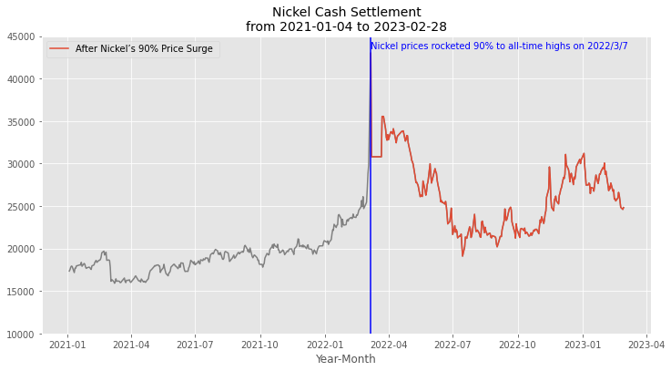
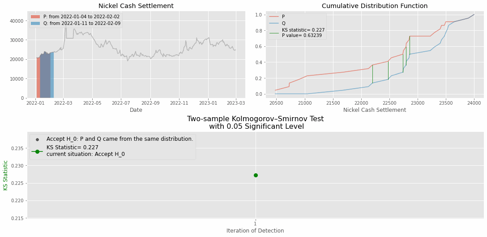
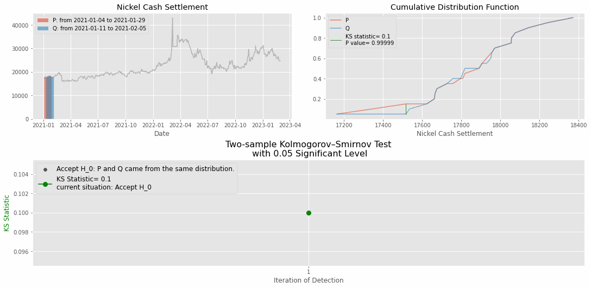

# Kolmogorov-Smirnov Test  
> 吳彥霖    on March 5, 2023   

在監控模型飄移(Model Drift)的方法中， KS 檢定(Kolmogorov-Smirnov Test, KS Test)可用來偵測是否發生資料飄移(Data Drift)，係一種無母數統計檢定(Nonparametric Statistics)，主要係藉由比較兩樣本的累積分佈函數(Cumulative Distribution Function, CDF)，透過計算兩 CDF 彼此之間的最大差距，推論兩樣本是否源自於同一個母體分佈。

## Python 程式碼範例    

  :point_left:

> Requirements :         

> 範例說明:   
> 在 2022年 3月初鎳的交易市場中，發生了前所未見的暴漲，市場將此事件稱為「妖鎳事件」。本範例將應用 2021 年起每個交易日的鎳現金結算數據，且使用 KS 檢定來觀察鎳的交易市場，在事件發生前後的時間，資料是否產生明顯的偏移現象?
> 

> 
> 
 
>  
> 數據飄移的偵測結果:   
> 兩樣本 KS 檢定中的虛無假設(Null Hypothesis)為兩樣本資料來自於同一母體分佈，當我們拒絕虛無假設時，意味著有顯著的證據指出，兩樣本之間存在差異。下列我們使用兩種不同的偵測方式:  
>  
> 方式一 : 固定一個滑動視窗 
> 

> 
> 

>
> 方式二 ; 滑動視窗皆不固定
> 

> 
> 

Back to [How to Detect Model Drift?](https://github.com/YenLinWu/Model_Drift#%E6%A8%A1%E5%9E%8B%E9%A3%84%E7%A7%BB-model-drift)
