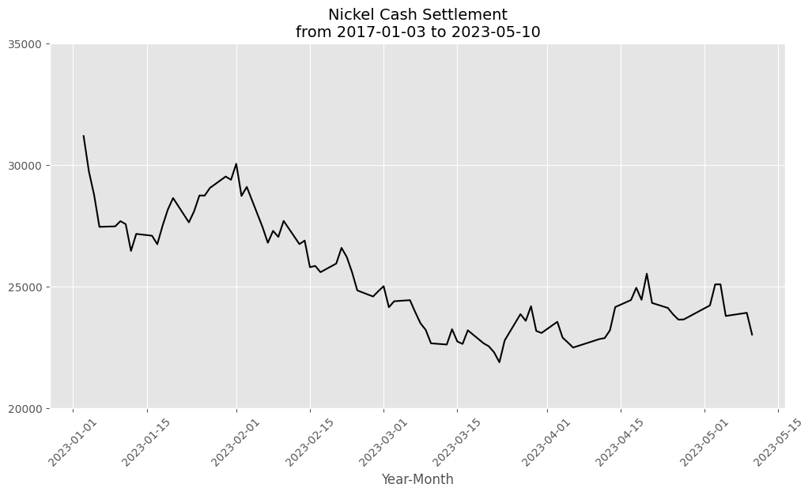
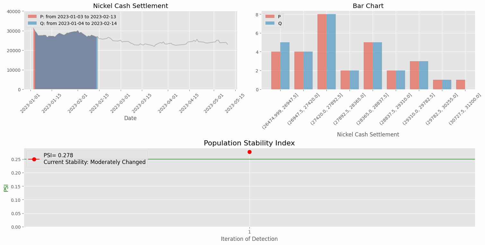

# Population Stability Index  
> 吳彥霖    on May 15, 2023   

在監控模型飄移(Model Drift)的方法中，母體穩定性指標(Population Stability Index, PSI)可用來偵測是否發生資料飄移(Data Drift)，係一種衡量特徵變數在不同時間或不同群組之間的穩定性。一般而言，當 PSI 值小於 0.1 時，表示此特徵變數具有高的穩定性。

## Python 程式碼範例    

  :point_left:  

> Requirements :         

> 範例說明:   
> 本範例將使用 2023 年起至 5 月 10 日這段期間每個交易日的鎳現金結算數據，以每 30 筆交易數據為基準，透過兩種滑動視窗的方式，計算兩不同時間點的 PSI 值，評量鎳現金結算的穩定性。
> 

> 
> 
 
>  
> 數據飄移的偵測結果:   
>  
> 方式一 : 固定一個滑動視窗   
> 隨著時間的推移，PSI 值逐漸變大，且 2023 年 1 月與 4 月的鎳現金結算趨勢明顯的不同；若以 2023 年前 30 個交易價格為基礎，鎳現金結算價格波動極大且不穩定。
> 

> 
> 

>
> 方式二 ; 滑動視窗皆不固定   
> 鎳現金結算的走勢在 2023 年 3 月初之後較之前相對穩定。
> 

> 
> 

Back to [How to Detect Model Drift?](https://github.com/YenLinWu/Model_Drift/tree/main#%E5%A6%82%E4%BD%95%E5%81%B5%E6%B8%AC%E6%A8%A1%E5%9E%8B%E9%A3%84%E7%A7%BB-how-to-detect-model-drift)
