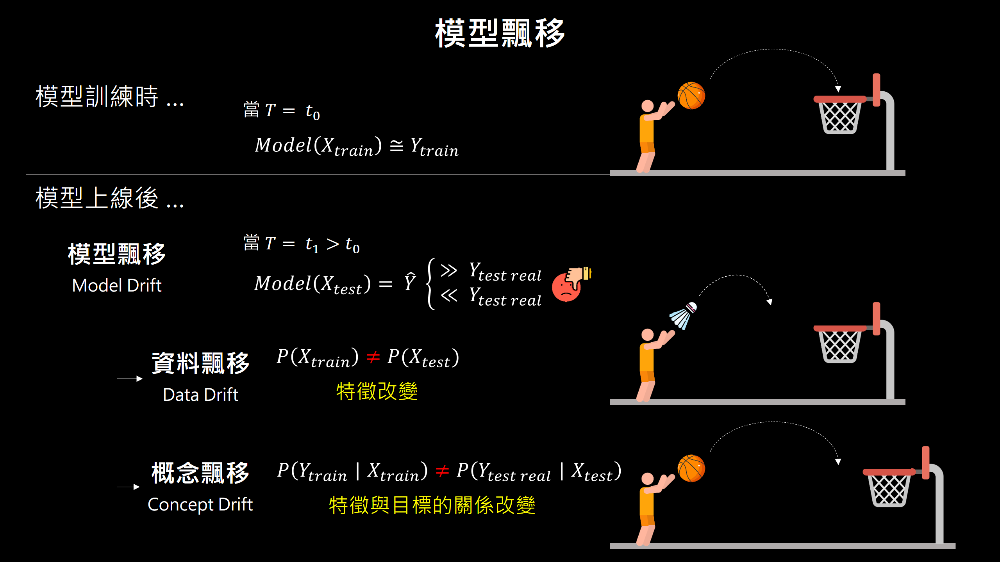
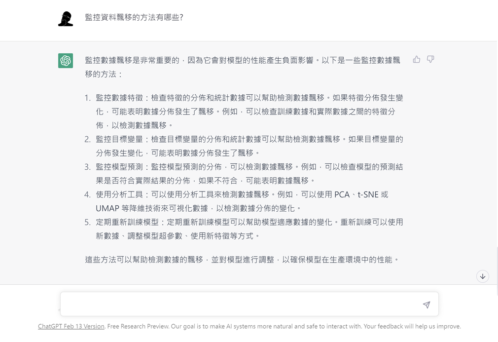

# 模型飄移 Model Drift
     

## 作者 Author     
 - &copy; 吳彥霖 Yen-Lin Wu &nbsp;

## 什麼是模型飄移 What is Model Drift?  
在機器學習與深度學習的應用中，我們常會遭遇到一種使用情境: 在模型上線使用一段時間後，模型的表現會隨著時間的推移而下降，我們稱這情況為「模型飄移(Model Drift)」。常見的模型飄移發生原因，為近期新的模型輸入資料，與之前訓練模型所使用的資料(稱之為訓練集 Training Data)，兩者的資料分佈或與目標變數(Target Variable)的關係發生了改變。模型飄移可區分成兩大類: 數據飄移(Data Drift)、概念飄移(Concept Drift)，說明如下:       
  
:warning: **資料飄移**: 輸入模型的特徵變數(Feature Variable)發生變化；  
:warning: **概念飄移**: 輸入模型的特徵變數(Feature Variable)沒有發生變化，但，特徵變數與目標變數之間的關係，隨著時間的推移發生改變。  

      

為降低模型飄移發生的可能性，下列為 ChatGPT 所提供用來監控模型飄移的方法:  

      

本專案將彙整用來偵測模型飄移的方法，內容包含: 方法的概念解釋與 Python 程式碼範例，期望對大家在維持模型的品質上能有所幫助!! :dart:

## 如何偵測模型飄移 How to Detect Model Drift?  
| 方法 | 目的 |
| ---------- | ----------- | 
| [KL and JS Divergence](https://github.com/YenLinWu/Model_Drift/blob/dev/KL_and_JS_Divergence/README.md#kullback-leibler-divergence--jensen-shannon-divergence) | 數據飄移 |
